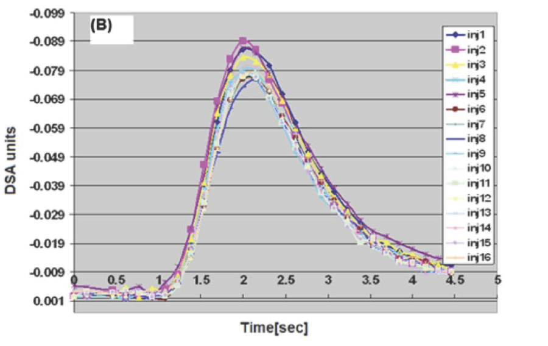
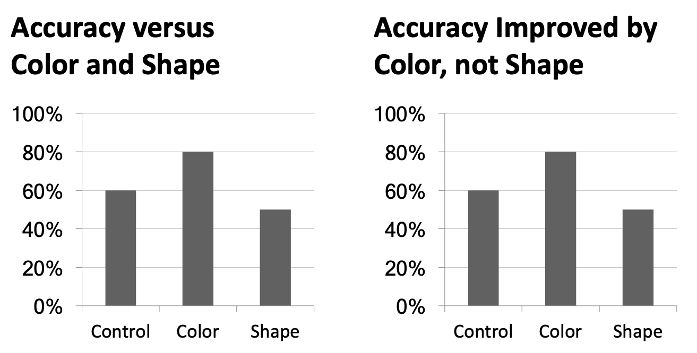

exclude: true

```{r setup, message=FALSE, warning=FALSE, include=FALSE}
options(
  htmltools.dir.version = FALSE, # for blogdown
  width=80
)

library(tidyverse)
library(repurrrsive)
```

---
class: center, middle

# Why do we visualize?

---

## Asncombe's Quartet

```{r}
datasets::anscombe %>% as_tibble()
```

---

## Tidy anscombe

.midi[
```{r}
(tidy_anscombe = datasets::anscombe %>%
  pivot_longer(everything(), names_sep = 1, names_to = c("var", "group")) %>%
  pivot_wider(id_cols = group, names_from = var, 
              values_from = value, values_fn = list(value = list)) %>% 
  unnest(cols = c(x,y)))
```
]

--

.midi[
```{r}
tidy_anscombe %>%
  group_by(group) %>%
  summarize(mean_x = mean(x), mean_y = mean(y), sd_x = sd(x), sd_y = sd(y), cor = cor(x,y))
```
]

---

```{r fig.width=7}
ggplot(tidy_anscombe, aes(x = x, y = y, color = as.factor(group))) +
  geom_point(size=2) +
  facet_wrap(vars(group)) +
  geom_smooth(method="lm", se=FALSE, fullrange=TRUE) +
  guides(color=FALSE)
```

---

## DatasauRus

.pull-left33[
```{r}
datasauRus::datasaurus_dozen
```
]

--

.pull-right66[
```{r}
datasauRus::datasaurus_dozen %>%
  group_by(dataset) %>%
  summarize(mean_x = mean(x), mean_y = mean(y), 
            sd_x = sd(x), sd_y = sd(y), 
            cor = cor(x,y))
```
]

---

```{r}
ggplot(datasauRus::datasaurus_dozen, aes(x = x, y = y, color = dataset)) +
  geom_point() +
  facet_wrap(vars(dataset)) +
  guides(color=FALSE)
```

---

## Simpson's Paradox

```{r include=FALSE}
datasauRus::simpsons_paradox %>%
  ggplot(aes(x=x, y=y, color=dataset)) +
    geom_point() +
    facet_wrap(vars(dataset))

ctrs = matrix(
  c(
    25,15,
    38,29,
    48,58,
    59,75,
    80,83
  ),
  byrow=TRUE,
  ncol=2
)

simpsons = datasauRus::simpsons_paradox %>%
  filter(dataset == "simpson_2", x < 75) %>%
  select(-dataset) %>%
  mutate(., group = kmeans(., ctrs)$cluster %>% as.character()) 
```

.pull-left[
```{r echo=FALSE} 
simpsons %>%
  ggplot(aes(x=x, y=y)) +
    geom_point() +
    geom_smooth(method="lm", se=FALSE, color="black")
```
]

--

.pull-right[
```{r echo = FALSE} 
simpsons %>%
  ggplot(aes(x=x, y=y, color=group)) +
    geom_point() +
    geom_smooth(method="lm", se=FALSE) +
    geom_smooth(method="lm", se=FALSE, color="black") +
    guides(color = FALSE)
```
]


---
class: center, middle

# Designing effective visualizations

---

## Keep it simple

<br/> <br/> <br/>

.pull-left[
```{r pie-3d, echo=FALSE, out.width=300}
knitr::include_graphics("imgs/pie-3d.jpg")
```
]

.pull-right[
```{r pie-to-bar, echo=FALSE, out.width=500}
d <- tribble(
  ~category,                     ~value,
  "Cutting tools"                , 0.03,
  "Buildings and administration" , 0.22,
  "Labor"                        , 0.31,
  "Machinery"                    , 0.27,
  "Workplace materials"          , 0.17
)
ggplot(d, aes(x = fct_reorder(category, value), y = value)) +
  geom_col() +
  theme_minimal() +
  coord_flip() +
  labs(x = "", y = "")
```
]

---

## Use color	to	draw	attention

<br/> <br/>

.pull-left[
```{r echo=FALSE, out.width=500}
d %>%
  mutate(category = str_replace(category, " ", "\n")) %>%
  ggplot(aes(x = category, y = value, fill = category)) +
    geom_col() +
    theme_minimal() +
    labs(x = "", y = "") +
    theme(legend.position = "none")
```
]

.pull-right[
```{r echo=FALSE, out.width=600}
ggplot(d, aes(x = fct_reorder(category, value), y = value, fill = category)) +
  geom_col() +
  theme_minimal() +
  coord_flip() +
  labs(x = "", y = "") +
  scale_fill_manual(values = c("red", rep("gray", 4))) +
  theme(legend.position = "none")
```
]

---

## Tell a story

```{r echo=FALSE, fig.align="center", out.width=800}
knitr::include_graphics("imgs/time-series.story.png")
```

.footnote[
*Credit*: Angela Zoss and Eric Monson, Duke DVS
]

---

## Leave out non-story details

<br/> <br/>

.pull-left[
```{r echo=FALSE, fig.align="center", out.width=500}

```
]

.pull-right[
```{r echo=FALSE, fig.align="center", out.width=500}
knitr::include_graphics("imgs/vis_inj2.png")
```
]


.footnote[
*Credit*: Angela Zoss and Eric Monson, Duke DVS
]

---

## Order / usage matters

<br/> <br/>

.pull-left[
```{r echo=FALSE, fig.align="center", out.width=350}
knitr::include_graphics("imgs/vis_order1.png")
```
]


.pull-right[
```{r echo=FALSE, fig.align="center", out.width=350}
knitr::include_graphics("imgs/vis_order2.png")
```
]


.footnote[
*Credit*: Angela Zoss and Eric Monson, Duke DVS
]

---

## Be clear about missing data

<br/><br/>

```{r echo=FALSE, fig.align="center", out.width="100%"}
knitr::include_graphics("imgs/vis_missing.png")
```

.footnote[
http://ivi.sagepub.com/content/10/4/271 <br/>
Angela Zoss and Eric Monson, Duke DVS
]


---

## Reduce cognitive burden

<br/> <br/>

```{r echo=FALSE, fig.align="center", out.width="100%"}
knitr::include_graphics("imgs/vis_text.png")
```

.footnote[
http://www.storytellingwithdata.com/2012/09/some-finer-points-of-data-visualization.html <br/>
Angela Zoss and Eric Monson, Duke DVS
]

---

## Use descriptive titles

<br/> <br/>

```{r echo=FALSE, fig.align="center", out.width="100%"}

```


.footnote[
*Credit*: Angela Zoss and Eric Monson, Duke DVS
]

---

## Annotate figures directly

<br/> <br/>

```{r echo=FALSE, fig.align="center", out.width="100%"}
knitr::include_graphics("imgs/vis_annotate.png")
```


.footnote[
https://bl.ocks.org/susielu/23dc3082669ee026c552b85081d90976
]

---

## All of the data doesn't tell a story

<br/>

```{r echo=FALSE, fig.align="center", out.width="80%"}
knitr::include_graphics("imgs/vis_nyt1.png")
```


.footnote[
http://www.nytimes.com/interactive/2014/06/05/upshot/how-the-recession-reshaped-the-economy-in-255-charts.html
]

---

## All of the data doesn't tell a story

<br/>

```{r echo=FALSE, fig.align="center", out.width="80%"}
knitr::include_graphics("imgs/vis_nyt2.png")
```


.footnote[
http://www.nytimes.com/interactive/2014/06/05/upshot/how-the-recession-reshaped-the-economy-in-255-charts.html
]

---

## All of the data doesn't tell a story

<br/>

```{r echo=FALSE, fig.align="center", out.width="80%"}
knitr::include_graphics("imgs/vis_nyt3.png")
```


.footnote[
http://www.nytimes.com/interactive/2014/06/05/upshot/how-the-recession-reshaped-the-economy-in-255-charts.html
]

---
class: middle, center

# Chart Remakes / Makeovers

---

## The Why Axis - BLS


```{r echo=FALSE, fig.align="center", out.width="80%"}
knitr::include_graphics("imgs/vis_bls.gif")
```

.footnote[
http://thewhyaxis.info/defaults/
]

---

## The Why Axis - Gender Gap

<br/>

```{r echo=FALSE, fig.align="center", out.width="60%"}
knitr::include_graphics("imgs/vis_gap.jpg")
```

.footnote[
http://thewhyaxis.info/gap-remake/
]

---
class: middle, center

# Acknowledgments

---

## Acknowledgments

Above materials are derived in part from the following sources:

* Hadley Wickham - [R for Data Science](http://r4ds.had.co.nz/) & [Elegant Graphics for Data Analysis](https://ggplot2-book.org)

* [ggplot2 website](https://ggplot2.tidyverse.org/)

* Visualization training materials developed by Angela Zoss and Eric Monson, [Duke DVS](http://libcms.oit.duke.edu/data/)


